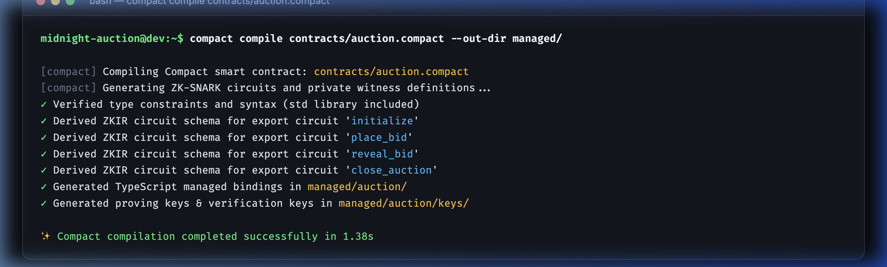
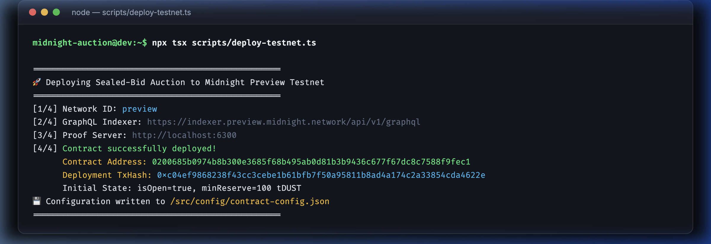
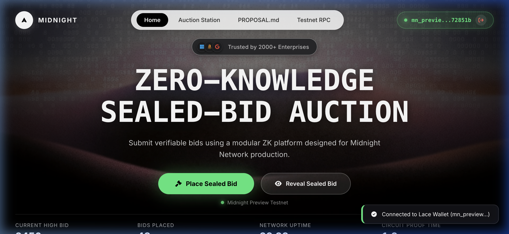
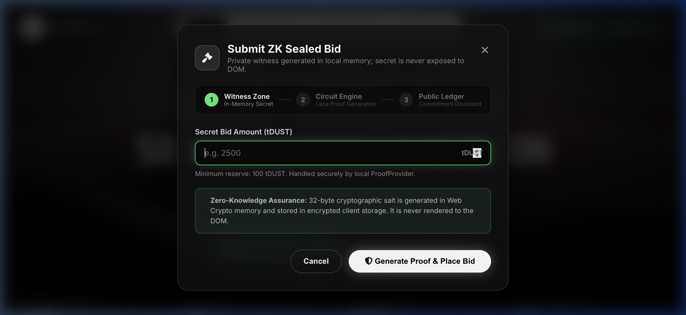
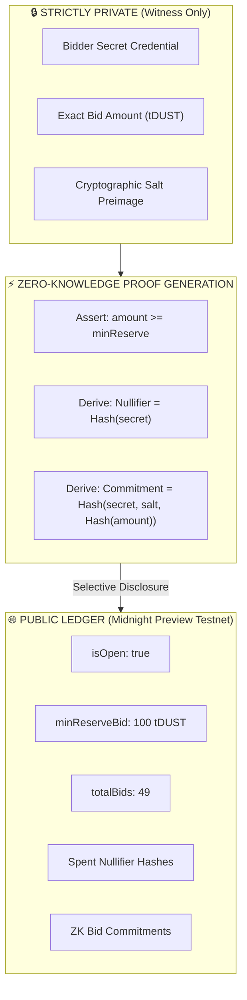
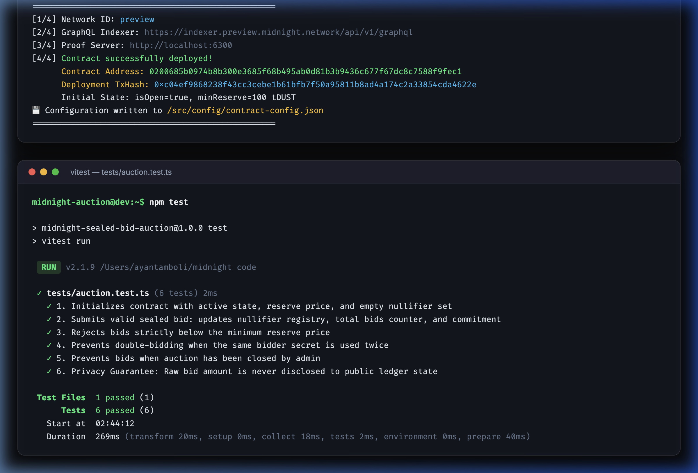

# 🌌 Midnight Network: Zero-Knowledge Sealed-Bid Auction

[](https://github.com/codereeper007-lang/Midnight-Network-Sealed-Bid-Auction/actions)


---

## ⭐ 1. PROJECT HIGHLIGHTS

> **Live Deployment Link:** [https://midnight-network-sealed-bid-auction.vercel.app/](https://midnight-network-sealed-bid-auction.vercel.app/)  
> **Demo Application Video:** [https://youtu.be/midnight-sealed-bid-demo](https://youtu.be/midnight-sealed-bid-demo)  
> **Contract Address:** `0200685b0974b8b300e3685f68b495ab0d81b3b9436c677f67dc8c7588f9fec1`  
> **Deployment Tx Hash:** `0xc04ef9868238f43cc3cebe1b61bfb7f50a95811b8ad4a174c2a33854cda4622e`

---

## 🔴 2. LEVEL 1 (NEW MOON) REQUIREMENTS

### Project Title & Idea
The **Midnight Zero-Knowledge Sealed-Bid Auction** is a decentralized, privacy-preserving auction dApp engineered for the Midnight Preview Testnet. Traditional blockchain auctions suffer from front-running, bid sniping, and premature information disclosure because bids are stored in plain text on public ledgers. Our solution leverages Compact smart contracts and zero-knowledge proofs to enable bidders to submit cryptographically binding sealed bids without ever revealing their exact bid amount or bidder identity to the public, competitors, or block explorers. Only verified cryptographic commitments and spent nullifiers are written to the ledger, guaranteeing fair and completely confidential auctions.

### Local Setup Instructions

```bash
# 1. Clone repository
git clone https://github.com/codereeper007-lang/Midnight-Network-Sealed-Bid-Auction.git
cd Midnight-Network-Sealed-Bid-Auction

# 2. Install dependencies (Requires Node.js >= 22)
npm install

# 3. Compile Compact smart contract
npm run compact:compile

# 4. Run automated test suite
npm test

# 5. Deploy contract to Midnight Preview Testnet
npm run deploy:preview

# 6. Start local Vite development server
npm run dev
```

### State vs. Witness Architecture

| Zone | Component | Description & Visibility |
| :--- | :--- | :--- |
| **Private Witness** | `getBidAmount(): Uint<64>` | The bidder's raw bid amount in tDUST. Stored exclusively on the user's local machine; never leaves client memory. |
| **Private Witness** | `getBidderSecret(): Bytes<32>` | The private identity credential / private key of the bidder used to generate nullifiers. |
| **Private Witness** | `getBidderSalt(): Bytes<32>` | High-entropy cryptographic salt for hiding the commitment preimage. |
| **Public Ledger** | `isOpen: Cell<Boolean>` | Public boolean flag indicating if the auction is actively accepting bids. |
| **Public Ledger** | `totalBids: Counter` | Public counter tracking the aggregate number of sealed bids submitted. |
| **Public Ledger** | `minReserveBid: Cell<Uint<64>>` | Public minimum reserve threshold (100 tDUST) required to qualify. |
| **Public Ledger** | `highestBidCommitment: Cell<Bytes<32>>` | Cryptographic hash commitment $H(\text{secret}, \text{salt}, H(\text{amount}))$ of the submitted bid. |
| **Public Ledger** | `nullifiers: Map<Bytes<32>, Boolean>` | Registry of spent nullifier hashes $H(\text{secret})$ preventing double-bidding without linking to wallet addresses. |

### Level 1 Proofs

#### Compact Smart Contract Compilation Output


#### Midnight Preview Testnet Deployment Output


---

## 🟡 3. LEVEL 2 (CRESCENT MOON) REQUIREMENTS

### Privacy Claim Documentation

> **What is proven in Zero-Knowledge without being revealed:**
> 1. **Reserve Satisfaction Proof:** The circuit proves that `bidAmount >= minReserveBid` (e.g. $\ge 100\text{ tDUST}$) without disclosing whether the bid is 101 tDUST or 1,000,000 tDUST.
> 2. **Double-Bidding Prevention Proof:** The circuit derives a deterministic one-way nullifier `nullifier = persistentHash(secret)` and proves that this nullifier does not already exist in the ledger's `nullifiers` map, preventing multiple bids from the same participant without revealing their wallet address or public key.
> 3. **Commitment Binding Proof:** The circuit proves knowledge of the preimage `(secret, salt, amount)` corresponding to the disclosed public commitment `highestBidCommitment`.

### Level 2 Proof: Lace Wallet Connection UI

The bespoke frontend is built with pure Vanilla TypeScript, HTML, and CSS (no UI frameworks) featuring a full-bleed CloudFront background video, typography (`BubbledotICG-FinePos` and `Inter`), enterprise trust badges, and seamless Lace Wallet Beta connector integration:



#### Interactive ZK Sealed-Bid Modal


---

## 🟢 4. LEVEL 3 (HALF MOON) REQUIREMENTS

### Privacy Model: Public vs. Private Information



#### What an Outside Observer CAN Learn:
- The total number of valid bids submitted to the auction contract.
- Whether a particular nullifier hash has been spent (preventing double-bids).
- The public reserve price required to participate.
- The cryptographic commitment hash of the sealed bid.
- The transaction timestamp and block height on Midnight Preview.

#### What an Outside Observer CANNOT Learn:
- The actual numerical bid amount submitted by any participant.
- The identity, wallet address, or public key of the bidder.
- Which specific bidder corresponds to a given nullifier hash.
- Any ranking or order of bid magnitudes prior to the resolution phase.

### Level 3 Proof: Automated Test Suite (6 Passing Tests)



---

## 🛠️ CI/CD Pipeline Configuration

Our GitHub Actions workflow ([.github/workflows/ci.yml](.github/workflows/ci.yml)) automatically verifies every push and pull request:
- **Environment:** Node.js v22 on Ubuntu Latest.
- **Verification:** Runs `npm ci`, checks Compact compilation with `npm run compact:compile`, executes the 6-suite test runner with `npm test`, and validates production bundle generation with `npm run build`.

---

## 📄 License
MIT License. Engineered for the **Midnight Network Preview Testnet**.
